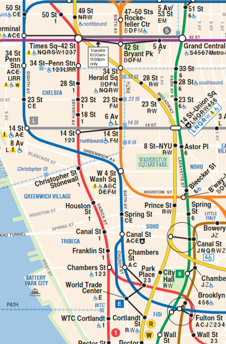

# Problem Statement

NYC Subway is a rapid transit system owned by the City of New York and leased to the New York City Transit Authority, a subsidiary agency of the state-run **Metropolitan Transportation Authority (MTA)**. It is one of the oldest and largest public transportation systems in the world, with **472** stations in operation. The subway system is the **most** used rapid transit system in the United States and the **seventh most** used rapid transit system in the world.[^1]

Given the high volume of traffic in the subway system, it is crucial to understand its available capacity. Intuitively, the capacity is influenced by the number of trains operating and the number of passengers already in the system. Thanks to the **MTA Open Data Program**[^2], we now have access to high-quality data that can help us better analyze and understand the subway system’s capacity.

## Problem A

Let’s say, we want to determine the **maximum remaining capacity** between **Times Sq-42 St** and **Fulton St**, through all possible routes, for some given time period. In particular, we consider **9 - 10 AM** on a weekday as the time period of interest. 

The subway routes between **Times Sq-42 St** and **Fulton St** are as follows:

  

and we consider all stations in this area as part of the route. 
In particular, we consider red line (1, 2, 3), blue line (A, C, E), green line (4, 5, 6), yellow line (N, Q, R, W), orange line (B, D, F, M), purple line (7) and gray line (L) as the subway lines connecting these two stations. Please download <a href=""> this matrix </a>  as a tool to help you determine the possible routes between these two stations.

> TO-DO: make an incidence matrix for the subway lines connecting these two stations.

Given the hourly ridership data for each station, we assume the number of passengers between two stations 
$$n_{ij} = \frac{n_i + n_j}{2}$$
where $n_i$ and $n_j$ denote the number of passengers at station $i$ and $j$, respectively. We assume the maximum total capacity between two stations $c_{ij}$ is proportional to the number of trains operating between these two stations, which can be estimated based on the number of delivered trains within the peak hours of the day.

Please help us determine the maximum remaining capacity between **Times Sq-42 St** and **Fulton St** for the time period of interest.

[^1]: https://github.com/features/copilot
[^2]: https://new.mta.info/open-data
